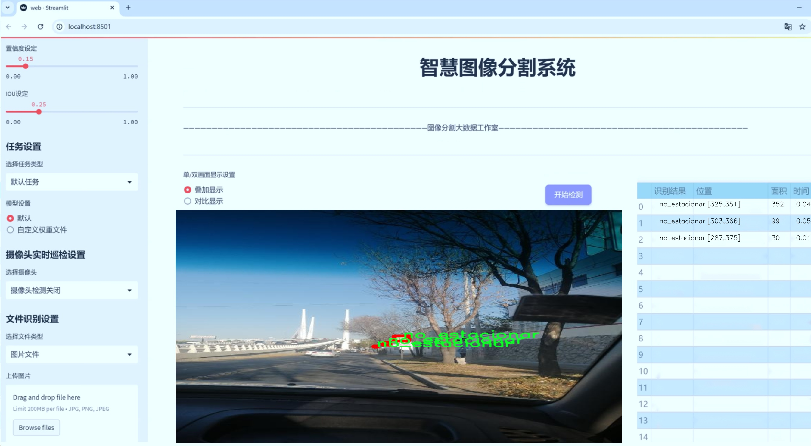

# 交通标志分割系统源码＆数据集分享
 [yolov8-seg-C2f-EMSC＆yolov8-seg-goldyolo等50+全套改进创新点发刊_一键训练教程_Web前端展示]

### 1.研究背景与意义

项目参考[ILSVRC ImageNet Large Scale Visual Recognition Challenge](https://gitee.com/YOLOv8_YOLOv11_Segmentation_Studio/projects)

项目来源[AAAI Global Al lnnovation Contest](https://kdocs.cn/l/cszuIiCKVNis)

研究背景与意义

随着城市化进程的加快，交通管理面临着日益严峻的挑战。交通标志作为道路安全的重要组成部分，其识别与分割的准确性直接影响到智能交通系统的效率与安全性。近年来，深度学习技术的迅猛发展为计算机视觉领域带来了革命性的变化，尤其是在目标检测与分割任务中，基于卷积神经网络（CNN）的算法表现出色。YOLO（You Only Look Once）系列模型因其高效的实时检测能力而广泛应用于各种视觉任务中。YOLOv8作为该系列的最新版本，进一步提升了模型的精度与速度，为交通标志的识别与分割提供了新的可能性。

本研究旨在基于改进的YOLOv8模型，构建一个高效的交通标志分割系统。我们使用的交通标志数据集包含2400张图像，涵盖多种交通标志类别。这一数据集的丰富性和多样性为模型的训练与评估提供了良好的基础。通过对数据集的深入分析，我们发现不同类型的交通标志在形状、颜色和尺寸上存在显著差异，这为模型的分割能力提出了更高的要求。因此，改进YOLOv8模型的结构与算法，增强其对复杂场景下交通标志的分割能力，具有重要的理论与实践意义。

在交通标志的分割任务中，传统的目标检测方法往往难以处理标志与背景之间的复杂关系，导致分割精度不足。为了解决这一问题，我们计划在YOLOv8的基础上引入多尺度特征融合和注意力机制，以提升模型对小型和重叠交通标志的识别能力。此外，针对数据集中的标志种类，我们将采用数据增强技术，扩充训练样本的多样性，从而提高模型的泛化能力。这些改进不仅能够提升交通标志的分割精度，还将为后续的智能交通系统提供更为可靠的数据支持。

本研究的意义不仅体现在理论层面，更在于其对实际交通管理的促进作用。随着自动驾驶技术的发展，交通标志的自动识别与分割已成为智能车辆安全行驶的关键环节。通过构建高效的交通标志分割系统，我们期望能够为智能交通系统的实现提供坚实的技术基础，推动智能交通的普及与应用。此外，研究成果还可为相关领域的研究提供借鉴，促进计算机视觉技术在交通管理中的进一步应用。

综上所述，基于改进YOLOv8的交通标志分割系统的研究，不仅具有重要的学术价值，还对提升交通安全、优化交通管理具有深远的社会意义。通过对交通标志的精准分割，我们将为智能交通的发展贡献一份力量，推动交通管理的智能化进程。

### 2.图片演示




##### 注意：由于此博客编辑较早，上面“2.图片演示”和“3.视频演示”展示的系统图片或者视频可能为老版本，新版本在老版本的基础上升级如下：（实际效果以升级的新版本为准）

  （1）适配了YOLOV8的“目标检测”模型和“实例分割”模型，通过加载相应的权重（.pt）文件即可自适应加载模型。

  （2）支持“图片识别”、“视频识别”、“摄像头实时识别”三种识别模式。

  （3）支持“图片识别”、“视频识别”、“摄像头实时识别”三种识别结果保存导出，解决手动导出（容易卡顿出现爆内存）存在的问题，识别完自动保存结果并导出到tempDir中。

  （4）支持Web前端系统中的标题、背景图等自定义修改，后面提供修改教程。

  另外本项目提供训练的数据集和训练教程,暂不提供权重文件（best.pt）,需要您按照教程进行训练后实现图片演示和Web前端界面演示的效果。

### 3.视频演示

[3.1 视频演示](https://www.bilibili.com/video/BV1Gt2EY8EeT/)

### 4.数据集信息展示

##### 4.1 本项目数据集详细数据（类别数＆类别名）

nc: 21
names: ['alto', 'bici', 'cinturon', 'curva', 'doble', 'escolares', 'estacionar', 'glorieta', 'no_estacionar', 'no_parada', 'no_retorno', 'no_vuelta_der', 'no_vuelta_iz', 'peatones', 'retorno', 'semaforo', 'tope', 'vel', 'vel_UPIIH', 'vuelta_der', 'vuelta_iz']


##### 4.2 本项目数据集信息介绍

数据集信息展示

在本研究中，我们使用了名为“Traffic Sign”的数据集，以改进YOLOv8-seg的交通标志分割系统。该数据集专注于交通标志的识别与分割，涵盖了21个不同的类别，旨在为自动驾驶、智能交通系统以及相关领域提供高质量的训练数据。数据集的类别丰富多样，具体包括：'alto'（停车标志）、'bici'（自行车标志）、'cinturon'（安全带标志）、'curva'（弯道标志）、'doble'（双向交通标志）、'escolares'（学校区域标志）、'estacionar'（停车标志）、'glorieta'（环形交叉口标志）、'no_estacionar'（禁止停车标志）、'no_parada'（禁止停靠标志）、'no_retorno'（禁止掉头标志）、'no_vuelta_der'（禁止右转标志）、'no_vuelta_iz'（禁止左转标志）、'peatones'（行人标志）、'retorno'（允许掉头标志）、'semaforo'（红绿灯标志）、'tope'（减速带标志）、'vel'（限速标志）、'vel_UPIIH'（限速标志-特殊情况）、'vuelta_der'（允许右转标志）、'vuelta_iz'（允许左转标志）。这些类别的选择不仅反映了交通标志的多样性，也为模型的训练提供了丰富的样本，增强了模型在实际应用中的泛化能力。

数据集中的每个类别都经过精心标注，确保了标注的准确性和一致性。这一过程不仅涉及到图像的收集，还包括对每个交通标志的细致分析，以确保在训练过程中，模型能够学习到每种标志的特征和形态。通过这种方式，YOLOv8-seg模型能够在面对复杂的交通环境时，准确识别和分割出不同类型的交通标志，从而提高自动驾驶系统的安全性和可靠性。

此外，数据集的构建还考虑到了不同的环境因素，例如光照变化、天气条件以及交通标志的不同状态（如损坏或遮挡）。这种多样性使得模型在训练时能够更好地适应现实世界中的各种情况，增强了其鲁棒性。通过对“Traffic Sign”数据集的深入分析与应用，我们希望能够推动交通标志识别技术的发展，为智能交通系统的实现奠定坚实的基础。

总之，“Traffic Sign”数据集不仅为改进YOLOv8-seg的交通标志分割系统提供了必要的训练数据，也为后续的研究和应用提供了重要的参考。通过对交通标志的准确识别与分割，我们期望能够在未来的智能交通领域中，发挥更大的作用，推动自动驾驶技术的进步与普及。


### 5.全套项目环境部署视频教程（零基础手把手教学）

[5.1 环境部署教程链接（零基础手把手教学）](https://www.bilibili.com/video/BV1jG4Ve4E9t/?vd_source=bc9aec86d164b67a7004b996143742dc)


[5.2 安装Python虚拟环境创建和依赖库安装视频教程链接（零基础手把手教学）](https://www.bilibili.com/video/BV1nA4VeYEze/?vd_source=bc9aec86d164b67a7004b996143742dc)

### 6.手把手YOLOV8-seg训练视频教程（零基础小白有手就能学会）

[6.1 手把手YOLOV8-seg训练视频教程（零基础小白有手就能学会）](https://www.bilibili.com/video/BV1cA4VeYETe/?vd_source=bc9aec86d164b67a7004b996143742dc)


按照上面的训练视频教程链接加载项目提供的数据集，运行train.py即可开始训练



     Epoch   gpu_mem       box       obj       cls    labels  img_size
     1/200     0G   0.01576   0.01955  0.007536        22      1280: 100%|██████████| 849/849 [14:42<00:00,  1.04s/it]
               Class     Images     Labels          P          R     mAP@.5 mAP@.5:.95: 100%|██████████| 213/213 [01:14<00:00,  2.87it/s]
                 all       3395      17314      0.994      0.957      0.0957      0.0843

     Epoch   gpu_mem       box       obj       cls    labels  img_size
     2/200     0G   0.01578   0.01923  0.007006        22      1280: 100%|██████████| 849/849 [14:44<00:00,  1.04s/it]
               Class     Images     Labels          P          R     mAP@.5 mAP@.5:.95: 100%|██████████| 213/213 [01:12<00:00,  2.95it/s]
                 all       3395      17314      0.996      0.956      0.0957      0.0845

     Epoch   gpu_mem       box       obj       cls    labels  img_size
     3/200     0G   0.01561    0.0191  0.006895        27      1280: 100%|██████████| 849/849 [10:56<00:00,  1.29it/s]
               Class     Images     Labels          P          R     mAP@.5 mAP@.5:.95: 100%|███████   | 187/213 [00:52<00:00,  4.04it/s]
                 all       3395      17314      0.996      0.957      0.0957      0.0845


### 7.50+种全套YOLOV8-seg创新点代码加载调参视频教程（一键加载写好的改进模型的配置文件）

[7.1 50+种全套YOLOV8-seg创新点代码加载调参视频教程（一键加载写好的改进模型的配置文件）](https://www.bilibili.com/video/BV1Hw4VePEXv/?vd_source=bc9aec86d164b67a7004b996143742dc)

### 8.YOLOV8-seg图像分割算法原理

原始YOLOV8-seg算法原理

YOLOV8-seg算法是YOLO系列中的最新版本，代表了目标检测和分割领域的一次重要进步。该算法不仅继承了YOLO系列的优良传统，还在多个方面进行了创新，旨在提高检测精度和处理速度。YOLOV8-seg的设计理念围绕着高效、准确和灵活的目标检测与分割展开，尤其适用于复杂场景下的实时应用。

首先，YOLOV8-seg算法的架构由三个主要部分组成：输入端、主干网络和检测端。输入端负责接收原始图像数据，并进行必要的预处理，如数据增强和归一化。YOLOV8-seg在数据预处理阶段，采用了多种增强技术，包括马赛克增强、混合增强、空间扰动和颜色扰动等。这些增强手段的引入，旨在提高模型的鲁棒性，使其能够在多样化的环境中保持良好的性能。

主干网络是YOLOV8-seg的核心部分，其设计基于YOLOv5的架构，但进行了显著的改进。YOLOV8-seg采用了C2f模块来替代YOLOv5中的C3模块。C2f模块的引入，增加了更多的残差连接，极大地丰富了梯度信息的流动，从而提升了模型的学习能力。通过这种方式，YOLOV8-seg能够更有效地提取图像中的特征，并为后续的目标检测和分割任务提供更为精准的基础。

在特征融合方面，YOLOV8-seg依然采用了FPN（特征金字塔网络）和PAN（路径聚合网络）的结构。这种结构的设计理念是通过多尺度特征的融合，提升模型对不同尺寸目标的检测能力。FPN和PAN的结合，使得YOLOV8-seg能够在不同层次上捕捉到丰富的上下文信息，从而更好地理解图像内容。

检测端是YOLOV8-seg的最后一环，采用了解耦合头结构。与以往的耦合头结构不同，解耦合头将分类和定位任务分开处理，使得模型在这两个任务上的表现更加独立和高效。YOLOV8-seg使用了Anchor-Free的策略，简化了目标检测过程中的锚框设计，使得模型能够更灵活地适应不同的目标形状和尺寸。

在损失函数的设计上，YOLOV8-seg引入了BCELoss作为分类损失，同时结合DFLLoss和CIoULoss作为回归损失。这种多重损失函数的设计，旨在平衡分类和定位任务的训练，确保模型在精度和速度上的双重提升。特别是Varifocal Loss的使用，通过对正负样本进行不对称加权，使得模型在训练过程中能够更加关注高质量的正样本，从而提升整体的检测性能。

YOLOV8-seg还在标签分配策略上进行了创新，采用了动态标签分配策略。这一策略通过有效地匹配正负样本，确保了模型在训练过程中能够充分利用每一个样本的信息。不同于以往依赖于候选框的策略，YOLOV8-seg的标签分配更加灵活，能够更好地适应数据集的多样性和复杂性。

总的来说，YOLOV8-seg算法在YOLO系列的基础上，通过对网络结构、损失函数、标签分配等多个方面的创新，显著提升了目标检测和分割的性能。其高效的设计使得YOLOV8-seg能够在实时应用中表现出色，广泛适用于智能监控、自动驾驶、人脸识别等多种场景。随着YOLOV8-seg的推出，目标检测和分割领域的研究和应用将迎来新的机遇，推动相关技术的进一步发展。


### 9.系统功能展示（检测对象为举例，实际内容以本项目数据集为准）

图9.1.系统支持检测结果表格显示

  图9.2.系统支持置信度和IOU阈值手动调节

  图9.3.系统支持自定义加载权重文件best.pt(需要你通过步骤5中训练获得)

  图9.4.系统支持摄像头实时识别

  图9.5.系统支持图片识别

  图9.6.系统支持视频识别

  图9.7.系统支持识别结果文件自动保存

  图9.8.系统支持Excel导出检测结果数据


### 10.50+种全套YOLOV8-seg创新点原理讲解（非科班也可以轻松写刊发刊，V11版本正在科研待更新）

#### 10.1 由于篇幅限制，每个创新点的具体原理讲解就不一一展开，具体见下列网址中的创新点对应子项目的技术原理博客网址【Blog】：


[10.1 50+种全套YOLOV8-seg创新点原理讲解链接](https://gitee.com/qunmasj/good)

#### 10.2 部分改进模块原理讲解(完整的改进原理见上图和技术博客链接)【此小节的图要是加载失败请移步原始博客查看，链接：https://blog.csdn.net/cheng2333333?type=blog】
### 全维动态卷积ODConv
鉴于上述讨论，我们的ODConv引入了一种多维注意机制，该机制具有并行策略，用于学习卷积核在核空间的所有四个维度上的不同注意。图提供了CondConv、DyConv和ODConv的示意性比较。

ODConv的公式：根据等式1中的符号，ODConv可定义为


 将注意力标量分配给整个卷积核。图2示出了将这四种类型的关注乘以n个卷积核的过程。原则上，这四种类型的关注是相互补充的，并且以位置、信道、滤波器和核的顺序将它们逐步乘以卷积核 
 ，使得卷积运算不同w.r.t.所有空间位置、所有输入信道、所有滤波器和输入x的所有核，提供捕获丰富上下文线索的性能保证。因此，ODConv可以显著增强CNN基本卷积运算的特征提取能力。此外，具有单个卷积核的ODConv可以与标准CondConv和DyConv竞争或优于它们，为最终模型引入的额外参数大大减少。提供了大量实验来验证这些优点。通过比较等式1和等式2，我们可以清楚地看到，ODConv是一种更广义的动态卷积。此外，当设置n=1且 所有分量均为1时，只关注滤波器方向 的ODConv将减少为：将基于输入特征的SE变量应用于卷积滤波器，然后进行卷积运算（注意原始SE（Hu等人，2018b）基于输出特征，并且用于重新校准输出特征本身）。这种SE变体是ODConv的特例。


图：将ODConv中的四种注意类型逐步乘以卷积核的示例。（a） 沿空间维度的逐位置乘法运算，（b）沿输入信道维度的逐信道乘法运算、（c）沿输出信道维度的按滤波器乘法运算，以及（d）沿卷积核空间的核维度的按核乘法运算。方法部分对符号进行了说明
实现：对于ODConv，一个关键问题是如何计算卷积核的四种关注度 。继CondConv和DyConv之后，我们还使用SE型注意力模块（Hu等人，2018b），但将多个头部作为来计算它们，其结构如图所示。具体而言，首先通过逐通道全局平均池（GAP）运算将输入压缩到具有长度的特征向量中。随后，存在完全连接（FC）层和四个头部分支。ReLU（Krizhevsky等人，2012）位于FC层之后。FC层将压缩特征向量映射到具有缩减比的低维空间（根据消融实验，我们在所有主要实验中设置 ，避免了高模型复杂度）。对于四个头部分支，每个分支都有一个输出大小如图。

### 引入ODConv的改进YOLO
参考这篇博客涵盖了引入ODConv的改进YOLOv8系统的内容，ODConv采用多维注意机制，在卷积核空间的四个维度上学习不同的注意。结合了CondConv和DyConv的优势，ODConv通过图示的四种注意类型逐步与卷积核相乘，以捕获丰富的上下文线索，提升特征提取能力。

#### ODConv结构与方法
ODConv的公式和图示展示了其关注力分配给卷积核的方式，其中四种类型的关注以位置、信道、滤波器和核的顺序逐步与卷积核相乘。这种结构保证了卷积运算不同于标准的Conv操作，能够捕获更多上下文信息，从而增强了CNN的特征提取能力。另外，单个卷积核的ODConv在性能上能够与CondConv和DyConv相竞争，并且引入的额外参数大幅减少。

ODConv的特殊之处在于其广义的动态卷积性质，同时在特定条件下（n=1且所有分量为1），它可以退化为一种特例，即只关注滤波器方向，这类似于基于输入特征的SE变体，但不同于原始SE，它基于输出特征。

#### ODConv的实现
关键问题在于如何计算卷积核的四种关注度。ODConv采用了SE型注意力模块，结合了多个头部来计算这些关注度。具体实现上，通过逐通道全局平均池运算和完全连接层，将输入压缩为特征向量，随后使用四个头部分支来计算四种不同类型的关注。这样的结构能在保持模型复杂度可控的情况下，提升了特征的表征能力。

ODConv的引入为YOLOv8带来了显著的性能提升，并且通过大量实验证明了其在特征提取方面的优越性。其结合了多维注意机制和卷积操作，为目标检测和分拣系统的提升带来了新的思路和性能突破。


### 11.项目核心源码讲解（再也不用担心看不懂代码逻辑）

#### 11.1 ultralytics\nn\extra_modules\head.py

以下是对代码中最核心部分的提取和详细中文注释。代码主要涉及YOLOv8模型的检测头部分，包括不同类型的检测头（如Detect_DyHead、Detect_AFPN等），这些检测头用于目标检测任务。

```python
import math
import torch
import torch.nn as nn
from torch.nn.init import constant_, xavier_uniform_

# 导入自定义模块
from ..modules import Conv, DFL, Proto
from ultralytics.utils.tal import dist2bbox, make_anchors

class Detect_DyHead(nn.Module):
    """YOLOv8 检测头，使用动态头（DyHead）进行目标检测。"""
    
    def __init__(self, nc=80, hidc=256, block_num=2, ch=()):
        """
        初始化检测头参数。
        
        参数:
        nc (int): 类别数量
        hidc (int): 隐藏层通道数
        block_num (int): 动态头块的数量
        ch (tuple): 输入通道数
        """
        super().__init__()
        self.nc = nc  # 类别数量
        self.nl = len(ch)  # 检测层数量
        self.reg_max = 16  # DFL通道数
        self.no = nc + self.reg_max * 4  # 每个锚点的输出数量
        self.stride = torch.zeros(self.nl)  # 构建时计算的步幅
        c2, c3 = max((16, ch[0] // 4, self.reg_max * 4)), max(ch[0], self.nc)  # 通道数
        self.conv = nn.ModuleList(nn.Sequential(Conv(x, hidc, 1)) for x in ch)  # 输入通道的卷积层
        self.dyhead = nn.Sequential(*[DyHeadBlock(hidc) for _ in range(block_num)])  # 动态头块
        self.cv2 = nn.ModuleList(
            nn.Sequential(Conv(hidc, c2, 3), Conv(c2, c2, 3), nn.Conv2d(c2, 4 * self.reg_max, 1)) for _ in ch)  # 预测框的卷积层
        self.cv3 = nn.ModuleList(nn.Sequential(Conv(hidc, c3, 3), Conv(c3, c3, 3), nn.Conv2d(c3, self.nc, 1)) for _ in ch)  # 类别的卷积层
        self.dfl = DFL(self.reg_max) if self.reg_max > 1 else nn.Identity()  # DFL层

    def forward(self, x):
        """连接并返回预测的边界框和类别概率。"""
        for i in range(self.nl):
            x[i] = self.conv[i](x[i])  # 对每个输入通道应用卷积
        x = self.dyhead(x)  # 通过动态头块处理
        shape = x[0].shape  # 获取输出形状
        for i in range(self.nl):
            # 连接预测框和类别输出
            x[i] = torch.cat((self.cv2[i](x[i]), self.cv3[i](x[i])), 1)
        if self.training:
            return x  # 如果在训练模式，返回每层的输出
        else:
            # 处理动态锚点和步幅
            self.anchors, self.strides = (x.transpose(0, 1) for x in make_anchors(x, self.stride, 0.5))
            self.shape = shape

        # 合并所有输出
        x_cat = torch.cat([xi.view(shape[0], self.no, -1) for xi in x], 2)
        box, cls = x_cat.split((self.reg_max * 4, self.nc), 1)  # 分割边界框和类别
        dbox = dist2bbox(self.dfl(box), self.anchors.unsqueeze(0), xywh=True, dim=1) * self.strides  # 转换为边界框
        y = torch.cat((dbox, cls.sigmoid()), 1)  # 合并边界框和类别概率
        return y  # 返回最终输出

    def bias_init(self):
        """初始化检测头的偏置，警告：需要步幅可用。"""
        for a, b, s in zip(self.cv2, self.cv3, self.stride):
            a[-1].bias.data[:] = 1.0  # 边界框偏置初始化
            b[-1].bias.data[:self.nc] = math.log(5 / self.nc / (640 / s) ** 2)  # 类别偏置初始化

# 其他检测头类（如Detect_AFPN_P345等）可以类似地进行提取和注释
```

### 核心部分说明：
1. **Detect_DyHead 类**：实现了YOLOv8的动态检测头，负责处理输入特征并输出边界框和类别概率。
2. **初始化方法**：设置了类别数量、隐藏层通道数、DFL通道数等，并定义了卷积层和动态头块。
3. **前向传播方法**：处理输入特征，生成边界框和类别概率，并在训练和推理模式下有不同的输出处理。
4. **偏置初始化方法**：为模型的输出层设置合适的偏置值，以帮助模型更快收敛。

可以根据需要对其他检测头类进行类似的提取和注释。

这个文件定义了YOLOv8模型中的多个检测头（Detect Head），主要用于目标检测任务。文件中包含了多个类，每个类实现了不同的检测头结构。以下是对文件内容的逐步分析。

首先，文件导入了一些必要的库和模块，包括数学库、PyTorch库以及自定义的模块和类。接着，定义了一个名为`Detect_DyHead`的类，这是YOLOv8中用于目标检测的动态头。这个类的构造函数接受类别数量、隐藏通道数、块数量和通道信息等参数，并初始化了一些重要的属性，比如类别数量、检测层数量、输出数量等。该类还定义了多个卷积层和动态头块（`DyHeadBlock`），用于处理输入特征图。

在`forward`方法中，首先对输入特征图进行卷积处理，然后通过动态头块进行进一步处理。接着，代码将不同层的输出进行拼接，计算锚框和步幅，并最终输出边界框和类别概率。这个方法还考虑了模型的训练和导出模式，以便在不同情况下返回合适的输出。

接下来，`Detect_DyHeadWithDCNV3`类继承自`Detect_DyHead`，其主要区别在于使用了不同的动态头块（`DyHeadBlockWithDCNV3`），这可能是为了在特定场景下提升性能。

`Detect_AFPN_P345`类实现了基于自适应特征金字塔网络（AFPN）的检测头。构造函数中初始化了AFPN模块和多个卷积层，`forward`方法与之前的类类似，处理输入特征图并返回边界框和类别概率。

`Detect_AFPN_P345_Custom`和`Detect_AFPN_P2345`类是对`Detect_AFPN_P345`的扩展，分别实现了自定义的AFPN和不同层数的AFPN结构。

`Detect_Efficient`类则实现了一个高效的检测头，使用了不同的卷积结构以提高计算效率。该类的`forward`方法与之前的类类似，处理输入并返回预测结果。

`DetectAux`类是一个辅助检测头，主要用于多任务学习。它的构造函数中定义了两个不同的卷积路径，以便在训练时同时处理主任务和辅助任务。

最后，`Segment_Efficient`类是一个用于分割任务的检测头，继承自`Detect_Efficient`。它增加了处理掩码原型的功能，以便在目标检测的同时进行实例分割。

整体来看，这个文件通过定义多个检测头类，提供了灵活的结构以适应不同的目标检测和分割任务，利用了PyTorch的模块化设计，使得模型的构建和训练更加高效和灵活。

#### 11.2 ui.py

以下是经过简化并添加详细中文注释的核心代码部分：

```python
import sys
import subprocess

def run_script(script_path):
    """
    使用当前 Python 环境运行指定的脚本。

    Args:
        script_path (str): 要运行的脚本路径

    Returns:
        None
    """
    # 获取当前 Python 解释器的路径
    python_path = sys.executable

    # 构建运行命令，使用 streamlit 运行指定的脚本
    command = f'"{python_path}" -m streamlit run "{script_path}"'

    # 执行命令并等待其完成
    result = subprocess.run(command, shell=True)
    
    # 检查命令执行结果，如果返回码不为0，则表示出错
    if result.returncode != 0:
        print("脚本运行出错。")

# 主程序入口
if __name__ == "__main__":
    # 指定要运行的脚本路径
    script_path = "web.py"  # 这里可以直接指定脚本路径

    # 调用函数运行脚本
    run_script(script_path)
```

### 代码注释说明：
1. **导入模块**：
   - `sys`：用于获取当前 Python 解释器的路径。
   - `subprocess`：用于执行外部命令。

2. **`run_script` 函数**：
   - 定义一个函数，用于运行指定路径的 Python 脚本。
   - 使用 `sys.executable` 获取当前 Python 解释器的路径，以确保使用正确的 Python 环境。
   - 构建命令字符串，使用 `streamlit` 模块运行指定的脚本。
   - 使用 `subprocess.run` 执行命令，并等待其完成。
   - 检查命令的返回码，如果不为0，表示脚本运行出错，并打印错误信息。

3. **主程序入口**：
   - 在脚本作为主程序运行时，指定要运行的脚本路径（这里直接指定为 `web.py`）。
   - 调用 `run_script` 函数，执行指定的脚本。

这个程序文件的主要功能是通过当前的 Python 环境来运行一个指定的脚本，具体是一个名为 `web.py` 的文件。程序首先导入了必要的模块，包括 `sys`、`os` 和 `subprocess`，以及一个自定义的路径处理模块 `abs_path`。

在 `run_script` 函数中，程序接收一个脚本路径作为参数。首先，它通过 `sys.executable` 获取当前 Python 解释器的路径。接着，构建一个命令字符串，这个命令使用 `streamlit` 模块来运行指定的脚本。`streamlit` 是一个用于构建数据应用的流行库。

随后，程序使用 `subprocess.run` 来执行这个命令，`shell=True` 允许在 shell 中执行命令。执行后，程序检查返回的结果码，如果不为零，表示脚本运行出错，程序会输出一条错误信息。

在文件的最后部分，程序通过 `if __name__ == "__main__":` 这一结构来确保只有在直接运行该文件时才会执行下面的代码。它指定了要运行的脚本路径为 `web.py`，并调用 `run_script` 函数来执行这个脚本。

总的来说，这个程序的目的是提供一个简单的接口，通过当前的 Python 环境来运行一个特定的脚本，并处理可能出现的错误。

#### 11.3 ultralytics\models\rtdetr\__init__.py

```python
# Ultralytics YOLO 🚀, AGPL-3.0 license

# 从当前模块导入 RTDETR 模型类
from .model import RTDETR

# 从当前模块导入 RTDETR 预测器类
from .predict import RTDETRPredictor

# 从当前模块导入 RTDETR 验证器类
from .val import RTDETRValidator

# 定义模块的公共接口，包含 RTDETR 预测器、验证器和模型类
__all__ = 'RTDETRPredictor', 'RTDETRValidator', 'RTDETR'
```

### 代码详细注释：
1. **模块说明**：该代码片段是 Ultralytics YOLO 项目的一部分，遵循 AGPL-3.0 许可证。
  
2. **导入模型类**：
   - `from .model import RTDETR`：从当前包的 `model` 模块中导入 `RTDETR` 类，该类通常用于定义目标检测模型的结构和参数。

3. **导入预测器类**：
   - `from .predict import RTDETRPredictor`：从当前包的 `predict` 模块中导入 `RTDETRPredictor` 类，该类负责使用训练好的模型进行目标检测的预测。

4. **导入验证器类**：
   - `from .val import RTDETRValidator`：从当前包的 `val` 模块中导入 `RTDETRValidator` 类，该类用于验证模型的性能，通常在模型训练后进行评估。

5. **定义公共接口**：
   - `__all__ = 'RTDETRPredictor', 'RTDETRValidator', 'RTDETR'`：该行代码定义了模块的公共接口，指定了当使用 `from module import *` 时，哪些类会被导入。这里包括了预测器、验证器和模型类，方便用户使用。

这个程序文件是一个Python模块的初始化文件，位于`ultralytics\models\rtdetr`目录下。它的主要功能是导入和暴露该模块中的关键类和功能，以便其他模块可以方便地使用。

首先，文件顶部的注释部分提到这是Ultralytics YOLO项目的一部分，并且遵循AGPL-3.0许可证。这表明该项目是开源的，用户可以自由使用和修改，但需要遵循相应的许可证条款。

接下来，文件通过`from .model import RTDETR`导入了`model.py`文件中的`RTDETR`类。这通常是一个与模型相关的类，可能包含模型的定义、结构和训练等功能。

然后，文件通过`from .predict import RTDETRPredictor`导入了`predict.py`文件中的`RTDETRPredictor`类。这个类很可能用于处理模型的预测功能，即如何使用训练好的模型对新数据进行推断。

接着，文件通过`from .val import RTDETRValidator`导入了`val.py`文件中的`RTDETRValidator`类。这个类可能用于模型的验证过程，包括评估模型在验证集上的表现等。

最后，`__all__`变量定义了模块的公共接口，列出了可以被外部导入的类。这里包括了`RTDETRPredictor`、`RTDETRValidator`和`RTDETR`。这意味着当其他模块使用`from ultralytics.models.rtdetr import *`语句时，只会导入这三个类，从而控制了模块的可见性和使用方式。

总的来说，这个初始化文件的作用是将RTDETR相关的功能模块化，使得其他部分的代码可以方便地引用和使用这些功能。

#### 11.4 train.py

以下是经过简化和注释的核心代码部分：

```python
import os
import torch
import yaml
from ultralytics import YOLO  # 导入YOLO模型

if __name__ == '__main__':  # 确保该模块被直接运行时才执行以下代码
    # 设置训练参数
    workers = 1  # 数据加载的工作进程数
    batch = 8  # 每个批次的样本数量
    device = "0" if torch.cuda.is_available() else "cpu"  # 检查是否有可用的GPU

    # 获取数据集的YAML配置文件的绝对路径
    data_path = abs_path(f'datasets/data/data.yaml', path_type='current')  

    # 读取YAML文件，保持原有顺序
    with open(data_path, 'r') as file:
        data = yaml.load(file, Loader=yaml.FullLoader)

    # 修改YAML文件中的路径项
    if 'train' in data and 'val' in data and 'test' in data:
        directory_path = os.path.dirname(data_path.replace(os.sep, '/'))  # 获取目录路径
        data['train'] = directory_path + '/train'  # 更新训练集路径
        data['val'] = directory_path + '/val'      # 更新验证集路径
        data['test'] = directory_path + '/test'    # 更新测试集路径

        # 将修改后的数据写回YAML文件
        with open(data_path, 'w') as file:
            yaml.safe_dump(data, file, sort_keys=False)

    # 加载YOLO模型配置文件和预训练权重
    model = YOLO(r"C:\codeseg\codenew\50+种YOLOv8算法改进源码大全和调试加载训练教程（非必要）\改进YOLOv8模型配置文件\yolov8-seg-C2f-Faster.yaml").load("./weights/yolov8s-seg.pt")

    # 开始训练模型
    results = model.train(
        data=data_path,  # 指定训练数据的配置文件路径
        device=device,  # 指定使用的设备（GPU或CPU）
        workers=workers,  # 指定数据加载的工作进程数
        imgsz=640,  # 输入图像的大小
        epochs=100,  # 训练的轮数
        batch=batch,  # 每个批次的样本数量
    )
```

### 代码注释说明：
1. **导入必要的库**：导入了操作系统、PyTorch、YAML处理库和YOLO模型。
2. **设置训练参数**：定义了数据加载的工作进程数、批次大小和设备类型（GPU或CPU）。
3. **获取数据集路径**：通过`abs_path`函数获取数据集配置文件的绝对路径。
4. **读取和修改YAML文件**：读取YAML文件，更新训练、验证和测试集的路径，并将修改后的内容写回文件。
5. **加载YOLO模型**：根据指定的配置文件和预训练权重加载YOLO模型。
6. **训练模型**：调用`model.train`方法开始训练，传入必要的参数如数据路径、设备、工作进程数、图像大小、训练轮数和批次大小。

该程序文件`train.py`主要用于训练YOLO（You Only Look Once）模型，具体是YOLOv8的一个变种，针对图像分割任务进行训练。程序的结构和功能可以分为几个主要部分。

首先，程序导入了必要的库，包括`os`、`torch`、`yaml`、`ultralytics`中的YOLO模型以及用于路径处理的`QtFusion.path`。此外，使用`matplotlib`库来设置图形界面。

在`__main__`块中，程序首先定义了一些训练参数，包括工作进程数`workers`、批次大小`batch`、以及设备类型`device`。设备类型会根据当前系统是否支持CUDA来选择，如果支持则使用GPU（"0"），否则使用CPU（"cpu"）。

接下来，程序通过`abs_path`函数获取数据集配置文件`data.yaml`的绝对路径，并将其转换为Unix风格的路径。然后，程序读取该YAML文件并解析其内容。特别地，如果YAML文件中包含`train`、`val`和`test`字段，程序会根据文件所在的目录修改这些路径，以确保它们指向正确的训练、验证和测试数据集。

在修改完路径后，程序将更新后的数据写回到YAML文件中。接着，程序加载YOLO模型的配置文件和预训练权重。这里的模型配置文件是`yolov8-seg-C2f-Faster.yaml`，而权重文件则是`yolov8s-seg.pt`。程序中还提到，如果所选模型的要求过高，用户可以选择其他模型进行测试。

最后，程序调用`model.train()`方法开始训练模型，传入训练数据的配置文件路径、设备类型、工作进程数、输入图像大小（640x640）、训练的轮数（100个epoch）以及批次大小（8）。通过这些设置，程序能够有效地训练YOLO模型，以适应特定的图像分割任务。

#### 11.5 ultralytics\utils\callbacks\wb.py

以下是代码中最核心的部分，并附上详细的中文注释：

```python
# 导入必要的库
from ultralytics.utils import SETTINGS, TESTS_RUNNING
from ultralytics.utils.torch_utils import model_info_for_loggers

try:
    # 确保不是在测试环境中运行
    assert not TESTS_RUNNING  
    # 确保WandB集成已启用
    assert SETTINGS['wandb'] is True  
    import wandb as wb  # 导入WandB库

    # 确保WandB库的版本可用
    assert hasattr(wb, '__version__')  

    import numpy as np  # 导入NumPy库
    import pandas as pd  # 导入Pandas库

    _processed_plots = {}  # 用于存储已处理的图表

except (ImportError, AssertionError):
    wb = None  # 如果导入失败或断言失败，则将wb设置为None


def _custom_table(x, y, classes, title='Precision Recall Curve', x_title='Recall', y_title='Precision'):
    """
    创建并记录自定义指标可视化到wandb.plot.pr_curve。

    该函数创建一个自定义指标可视化，模仿WandB默认的精确度-召回曲线行为，同时允许增强的自定义。
    该可视化指标用于监控模型在不同类别上的性能。

    参数:
        x (List): x轴的值，长度为N。
        y (List): y轴的对应值，长度也为N。
        classes (List): 标识每个点类别的标签，长度为N。
        title (str, optional): 图表的标题，默认为'Precision Recall Curve'。
        x_title (str, optional): x轴的标签，默认为'Recall'。
        y_title (str, optional): y轴的标签，默认为'Precision'。

    返回:
        (wandb.Object): 适合记录的wandb对象，展示了创建的指标可视化。
    """
    # 创建数据框
    df = pd.DataFrame({'class': classes, 'y': y, 'x': x}).round(3)
    fields = {'x': 'x', 'y': 'y', 'class': 'class'}
    string_fields = {'title': title, 'x-axis-title': x_title, 'y-axis-title': y_title}
    # 返回WandB表格可视化
    return wb.plot_table('wandb/area-under-curve/v0',
                         wb.Table(dataframe=df),
                         fields=fields,
                         string_fields=string_fields)


def _plot_curve(x, y, names=None, id='precision-recall', title='Precision Recall Curve', x_title='Recall', y_title='Precision', num_x=100, only_mean=False):
    """
    记录指标曲线可视化。

    该函数基于输入数据生成指标曲线，并将可视化记录到WandB。
    曲线可以表示聚合数据（均值）或单个类别数据，具体取决于'only_mean'标志。

    参数:
        x (np.ndarray): x轴的数据点，长度为N。
        y (np.ndarray): y轴的对应数据点，形状为CxN，其中C表示类别数量。
        names (list, optional): y轴数据对应的类别名称，长度为C。默认为空列表。
        id (str, optional): 在WandB中记录数据的唯一标识符。默认为'precision-recall'。
        title (str, optional): 可视化图表的标题。默认为'Precision Recall Curve'。
        x_title (str, optional): x轴的标签。默认为'Recall'。
        y_title (str, optional): y轴的标签。默认为'Precision'。
        num_x (int, optional): 可视化的插值数据点数量。默认为100。
        only_mean (bool, optional): 标志，指示是否仅绘制均值曲线。默认为True。

    注意:
        该函数利用'_custom_table'函数生成实际的可视化。
    """
    # 创建新的x值
    if names is None:
        names = []
    x_new = np.linspace(x[0], x[-1], num_x).round(5)

    # 创建用于记录的数组
    x_log = x_new.tolist()
    y_log = np.interp(x_new, x, np.mean(y, axis=0)).round(3).tolist()

    if only_mean:
        # 仅记录均值曲线
        table = wb.Table(data=list(zip(x_log, y_log)), columns=[x_title, y_title])
        wb.run.log({title: wb.plot.line(table, x_title, y_title, title=title)})
    else:
        # 记录每个类别的曲线
        classes = ['mean'] * len(x_log)
        for i, yi in enumerate(y):
            x_log.extend(x_new)  # 添加新的x值
            y_log.extend(np.interp(x_new, x, yi))  # 将y插值到新的x
            classes.extend([names[i]] * len(x_new))  # 添加类别名称
        wb.log({id: _custom_table(x_log, y_log, classes, title, x_title, y_title)}, commit=False)


def on_fit_epoch_end(trainer):
    """在每个训练周期结束时记录训练指标和模型信息。"""
    wb.run.log(trainer.metrics, step=trainer.epoch + 1)  # 记录训练指标
    _log_plots(trainer.plots, step=trainer.epoch + 1)  # 记录训练图表
    if trainer.epoch == 0:
        wb.run.log(model_info_for_loggers(trainer), step=trainer.epoch + 1)  # 记录模型信息


def on_train_end(trainer):
    """在训练结束时保存最佳模型作为artifact。"""
    _log_plots(trainer.validator.plots, step=trainer.epoch + 1)  # 记录验证图表
    art = wb.Artifact(type='model', name=f'run_{wb.run.id}_model')  # 创建模型artifact
    if trainer.best.exists():
        art.add_file(trainer.best)  # 添加最佳模型文件
        wb.run.log_artifact(art, aliases=['best'])  # 记录artifact
    wb.run.finish()  # 结束WandB运行
```

### 代码核心部分说明：
1. **WandB集成**：代码通过`wandb`库记录训练过程中的各种指标和可视化，确保在合适的环境中运行。
2. **自定义可视化**：提供了自定义函数`_custom_table`和`_plot_curve`，用于生成和记录精确度-召回曲线的可视化。
3. **训练过程回调**：定义了多个回调函数（如`on_fit_epoch_end`和`on_train_end`），用于在训练过程中记录模型的性能指标和保存最佳模型。


#### 11.5 ultralytics\nn\backbone\repvit.py

以下是代码中最核心的部分，并附上详细的中文注释：

```python
import torch.nn as nn
import torch

class Conv2d_BN(torch.nn.Sequential):
    """
    定义一个包含卷积层和批归一化层的组合模块
    """
    def __init__(self, a, b, ks=1, stride=1, pad=0, dilation=1,
                 groups=1, bn_weight_init=1):
        super().__init__()
        # 添加卷积层
        self.add_module('c', torch.nn.Conv2d(
            a, b, ks, stride, pad, dilation, groups, bias=False))
        # 添加批归一化层
        self.add_module('bn', torch.nn.BatchNorm2d(b))
        # 初始化批归一化层的权重
        torch.nn.init.constant_(self.bn.weight, bn_weight_init)
        torch.nn.init.constant_(self.bn.bias, 0)

    @torch.no_grad()
    def fuse_self(self):
        """
        将卷积层和批归一化层融合为一个卷积层
        """
        c, bn = self._modules.values()  # 获取卷积层和批归一化层
        # 计算新的卷积权重和偏置
        w = bn.weight / (bn.running_var + bn.eps)**0.5
        w = c.weight * w[:, None, None, None]
        b = bn.bias - bn.running_mean * bn.weight / (bn.running_var + bn.eps)**0.5
        # 创建新的卷积层
        m = torch.nn.Conv2d(w.size(1) * self.c.groups, w.size(0), w.shape[2:], 
                             stride=self.c.stride, padding=self.c.padding, 
                             dilation=self.c.dilation, groups=self.c.groups,
                             device=c.weight.device)
        m.weight.data.copy_(w)  # 复制权重
        m.bias.data.copy_(b)    # 复制偏置
        return m

class RepViTBlock(nn.Module):
    """
    定义RepViT的基本模块，包含token混合和channel混合
    """
    def __init__(self, inp, hidden_dim, oup, kernel_size, stride, use_se, use_hs):
        super(RepViTBlock, self).__init__()
        assert stride in [1, 2]
        self.identity = stride == 1 and inp == oup  # 判断是否为恒等映射
        assert(hidden_dim == 2 * inp)  # 确保hidden_dim是输入通道数的两倍

        if stride == 2:
            # 如果步幅为2，使用卷积和SE模块
            self.token_mixer = nn.Sequential(
                Conv2d_BN(inp, inp, kernel_size, stride, (kernel_size - 1) // 2, groups=inp),
                nn.Identity() if not use_se else SqueezeExcite(inp, 0.25),
                Conv2d_BN(inp, oup, ks=1, stride=1, pad=0)
            )
            self.channel_mixer = Residual(nn.Sequential(
                Conv2d_BN(oup, 2 * oup, 1, 1, 0),
                nn.GELU() if use_hs else nn.GELU(),
                Conv2d_BN(2 * oup, oup, 1, 1, 0, bn_weight_init=0),
            ))
        else:
            assert(self.identity)
            # 如果步幅为1，使用RepVGGDW模块
            self.token_mixer = nn.Sequential(
                RepVGGDW(inp),
                nn.Identity() if not use_se else SqueezeExcite(inp, 0.25),
            )
            self.channel_mixer = Residual(nn.Sequential(
                Conv2d_BN(inp, hidden_dim, 1, 1, 0),
                nn.GELU() if use_hs else nn.GELU(),
                Conv2d_BN(hidden_dim, oup, 1, 1, 0, bn_weight_init=0),
            ))

    def forward(self, x):
        """
        前向传播
        """
        return self.channel_mixer(self.token_mixer(x))

class RepViT(nn.Module):
    """
    定义RepViT模型
    """
    def __init__(self, cfgs):
        super(RepViT, self).__init__()
        self.cfgs = cfgs  # 模型配置
        input_channel = self.cfgs[0][2]  # 输入通道数
        # 构建初始层
        patch_embed = torch.nn.Sequential(
            Conv2d_BN(3, input_channel // 2, 3, 2, 1),
            torch.nn.GELU(),
            Conv2d_BN(input_channel // 2, input_channel, 3, 2, 1)
        )
        layers = [patch_embed]
        # 构建RepViTBlock
        block = RepViTBlock
        for k, t, c, use_se, use_hs, s in self.cfgs:
            output_channel = _make_divisible(c, 8)  # 确保输出通道数可被8整除
            exp_size = _make_divisible(input_channel * t, 8)  # 扩展通道数
            layers.append(block(input_channel, exp_size, output_channel, k, s, use_se, use_hs))
            input_channel = output_channel  # 更新输入通道数
        self.features = nn.ModuleList(layers)  # 将所有层放入ModuleList中

    def forward(self, x):
        """
        前向传播，返回特征图
        """
        input_size = x.size(2)
        scale = [4, 8, 16, 32]  # 特征图缩放比例
        features = [None] * len(scale)
        for f in self.features:
            x = f(x)
            if input_size // x.size(2) in scale:
                features[scale.index(input_size // x.size(2))] = x
        return features

def repvit_m0_9(weights=''):
    """
    构建RepViT模型的一个变体
    """
    cfgs = [
        # k, t, c, SE, HS, s 
        [3, 2, 48, 1, 0, 1],
        # ... 省略其他配置
    ]
    model = RepViT(cfgs)  # 创建模型
    if weights:
        model.load_state_dict(update_weight(model.state_dict(), torch.load(weights)['model']))  # 加载权重
    return model
```

### 主要功能
1. **卷积和批归一化融合**：`Conv2d_BN`类实现了卷积层和批归一化层的融合，以提高模型的推理速度。
2. **RepViTBlock**：实现了RepViT的基本模块，包含token混合和channel混合，支持不同的步幅和通道数。
3. **RepViT模型**：`RepViT`类定义了整个模型的结构，通过配置参数动态构建网络层。
4. **权重加载**：提供了加载预训练权重的功能，方便模型的迁移学习。

以上是代码的核心部分及其详细注释，帮助理解RepViT模型的构建和功能。

这个程序文件定义了一个名为 `RepViT` 的深度学习模型，主要用于计算机视觉任务。该模型的架构基于 MobileNet 的设计理念，结合了残差连接和深度可分离卷积等技术，以提高模型的性能和效率。

首先，文件导入了必要的库，包括 PyTorch 的神经网络模块、NumPy 以及来自 timm 库的 SqueezeExcite 层。接着，定义了一些公共接口（`__all__`），用于导出不同版本的 RepViT 模型。

`replace_batchnorm` 函数用于替换模型中的 BatchNorm 层，将其替换为 Identity 层，以便在推理时提高效率。这个函数递归地遍历模型的所有子模块，查找并替换 BatchNorm 层。

`_make_divisible` 函数确保所有层的通道数是可被 8 整除的，这对于某些硬件加速器的性能优化是必要的。

接下来，定义了几个类，包括 `Conv2d_BN`、`Residual`、`RepVGGDW`、`RepViTBlock` 和 `RepViT`。`Conv2d_BN` 类是一个组合模块，包含卷积层和 BatchNorm 层，并提供了一个融合方法以提高推理速度。`Residual` 类实现了残差连接，并在训练期间可以选择性地丢弃一些输入，以增加模型的鲁棒性。`RepVGGDW` 类则实现了深度可分离卷积的变体。

`RepViTBlock` 类构建了模型的基本构件，包含了通道混合和标记混合的操作，支持使用 SqueezeExcite 和 GELU 激活函数。`RepViT` 类则是整个模型的构建器，接受配置参数并构建多个 `RepViTBlock` 以形成完整的网络结构。

模型的前向传播方法会根据输入的大小返回特征图，支持多尺度特征提取。`switch_to_deploy` 方法用于在推理时替换 BatchNorm 层，以提高效率。

此外，文件中还定义了几个函数（如 `update_weight`）用于加载模型权重，并提供了多个构造函数（如 `repvit_m0_9`、`repvit_m1_0` 等）来创建不同配置的 RepViT 模型。

最后，文件的主程序部分演示了如何实例化一个 `RepViT` 模型，并通过随机输入进行前向传播，输出各层的特征图大小。这为用户提供了一个完整的模型构建和测试流程。

#### 11.6 ultralytics\nn\extra_modules\ops_dcnv3\modules\dcnv3.py

以下是提取出的核心部分代码，并附上详细的中文注释：

```python
import torch
from torch import nn
import torch.nn.functional as F
from torch.nn.init import xavier_uniform_, constant_

class DCNv3(nn.Module):
    def __init__(self, channels=64, kernel_size=3, stride=1, pad=1, dilation=1, group=4, offset_scale=1.0, center_feature_scale=False, remove_center=False):
        """
        DCNv3模块的初始化函数
        :param channels: 输入通道数
        :param kernel_size: 卷积核大小
        :param stride: 步幅
        :param pad: 填充
        :param dilation: 膨胀
        :param group: 分组数
        :param offset_scale: 偏移缩放因子
        :param center_feature_scale: 是否使用中心特征缩放
        :param remove_center: 是否移除中心
        """
        super().__init__()
        if channels % group != 0:
            raise ValueError(f'channels must be divisible by group, but got {channels} and {group}')
        
        self.channels = channels
        self.kernel_size = kernel_size
        self.stride = stride
        self.dilation = dilation
        self.pad = pad
        self.group = group
        self.group_channels = channels // group
        self.offset_scale = offset_scale
        self.center_feature_scale = center_feature_scale
        self.remove_center = int(remove_center)

        # 定义线性层用于计算偏移量和掩码
        self.offset = nn.Linear(channels, group * (kernel_size * kernel_size - remove_center) * 2)
        self.mask = nn.Linear(channels, group * (kernel_size * kernel_size - remove_center))
        self.input_proj = nn.Linear(channels, channels)  # 输入投影层
        self.output_proj = nn.Linear(channels, channels)  # 输出投影层
        self._reset_parameters()  # 初始化参数

        if center_feature_scale:
            self.center_feature_scale_proj_weight = nn.Parameter(torch.zeros((group, channels), dtype=torch.float))
            self.center_feature_scale_proj_bias = nn.Parameter(torch.tensor(0.0, dtype=torch.float).view((1,)).repeat(group, ))

    def _reset_parameters(self):
        """重置网络参数"""
        constant_(self.offset.weight.data, 0.)
        constant_(self.offset.bias.data, 0.)
        constant_(self.mask.weight.data, 0.)
        constant_(self.mask.bias.data, 0.)
        xavier_uniform_(self.input_proj.weight.data)
        constant_(self.input_proj.bias.data, 0.)
        xavier_uniform_(self.output_proj.weight.data)
        constant_(self.output_proj.bias.data, 0.)

    def forward(self, input):
        """
        前向传播函数
        :param input: 输入张量，形状为 (N, H, W, C)
        :return: 输出张量，形状为 (N, H, W, C)
        """
        N, H, W, _ = input.shape  # 获取输入的形状

        x = self.input_proj(input)  # 输入投影
        x_proj = x  # 保存投影后的输入用于后续计算

        x1 = input.permute(0, 3, 1, 2)  # 调整输入张量的维度顺序
        offset = self.offset(x1)  # 计算偏移量
        mask = self.mask(x1).reshape(N, H, W, self.group, -1)  # 计算掩码并调整形状
        mask = F.softmax(mask, -1)  # 对掩码进行softmax归一化

        # 使用DCNv3函数进行卷积操作
        x = DCNv3Function.apply(
            x, offset, mask,
            self.kernel_size, self.kernel_size,
            self.stride, self.stride,
            self.pad, self.pad,
            self.dilation, self.dilation,
            self.group, self.group_channels,
            self.offset_scale,
            256,
            self.remove_center)

        if self.center_feature_scale:
            # 如果启用中心特征缩放，进行相应的计算
            center_feature_scale = self.center_feature_scale_proj_weight @ x1 + self.center_feature_scale_proj_bias
            center_feature_scale = center_feature_scale[..., None].repeat(1, 1, 1, 1, self.channels // self.group).flatten(-2)
            x = x * (1 - center_feature_scale) + x_proj * center_feature_scale  # 融合中心特征

        x = self.output_proj(x)  # 输出投影
        return x  # 返回最终输出
```

### 代码说明：
1. **DCNv3类**：这是一个实现了深度可分离卷积的模块，主要用于图像处理任务。
2. **初始化函数**：在构造函数中，设置了网络的参数，包括通道数、卷积核大小、步幅等，并定义了用于计算偏移量和掩码的线性层。
3. **参数重置**：使用`_reset_parameters`方法初始化网络的权重和偏置。
4. **前向传播**：在`forward`方法中，输入数据经过线性投影、偏移量和掩码的计算后，使用自定义的`DCNv3Function`进行卷积操作，最后返回输出结果。

通过这些注释，可以更好地理解代码的结构和功能。

这个程序文件实现了一个名为 DCNv3 的深度学习模块，主要用于计算机视觉任务中的卷积操作。该模块的设计灵感来源于动态卷积（Dynamic Convolution），并且提供了多种灵活的参数配置，以适应不同的网络结构和需求。

首先，文件中引入了一些必要的库，包括 PyTorch 和一些神经网络模块。接着，定义了几个辅助类和函数。`to_channels_first` 和 `to_channels_last` 类用于在输入数据的通道格式（channels first 和 channels last）之间进行转换，这在处理不同格式的数据时非常有用。

`build_norm_layer` 函数用于构建归一化层，支持批归一化（Batch Normalization）和层归一化（Layer Normalization），并根据输入和输出格式进行相应的转换。`build_act_layer` 函数则用于构建激活函数层，支持 ReLU、SiLU 和 GELU 激活函数。

`_is_power_of_2` 函数用于检查一个数是否是 2 的幂，这在某些情况下可以提高计算效率。

`CenterFeatureScaleModule` 类实现了一个中心特征缩放模块，通过线性变换生成一个缩放因子，用于调整特征图的中心部分。

`DCNv3_pytorch` 类是 DCNv3 模块的核心实现。它的构造函数接收多个参数，如通道数、卷积核大小、步幅、填充、扩张、分组数等。构造函数中还定义了深度可分离卷积（depthwise convolution）、偏移量（offset）和掩码（mask）的线性层，以及输入和输出的线性投影层。`_reset_parameters` 方法用于初始化这些层的参数。

在 `forward` 方法中，输入数据经过一系列线性变换和卷积操作，生成偏移量和掩码，然后调用 `dcnv3_core_pytorch` 函数进行动态卷积的核心计算。如果启用了中心特征缩放，则会计算缩放因子并调整输出特征图。最后，输出经过投影层处理后返回。

`DCNv3` 类是 DCNv3 模块的另一种实现，使用了一个名为 `Conv` 的自定义卷积类。它的构造函数和 `DCNv3_pytorch` 类类似，但在实现细节上有所不同。

`DCNv3_DyHead` 类是 DCNv3 模块的动态头实现，主要用于处理输入的偏移量和掩码。它的 `forward` 方法调用了动态卷积的核心函数，并在最后返回处理后的输出。

总体来说，这个文件实现了一个灵活且高效的动态卷积模块，适用于各种计算机视觉任务，能够根据输入数据的不同格式和需求进行调整。

### 12.系统整体结构（节选）

### 整体功能和构架概括

Ultralytics 是一个用于目标检测和图像分割的深度学习框架，提供了多种模型架构和工具，旨在简化模型的训练、验证和推理过程。该框架的设计是模块化的，各个组件之间相互独立又可以协同工作。整体架构包括模型定义、训练流程、推理过程、结果处理和可视化等多个方面。

以下是各个文件的功能整理：

| 文件路径                                      | 功能描述                                                                 |
|-----------------------------------------------|--------------------------------------------------------------------------|
| `ultralytics/nn/extra_modules/head.py`      | 定义了不同的检测头类，支持多种目标检测和分割任务的模型结构。               |
| `ui.py`                                       | 提供了一个简单的接口来运行特定的脚本，并处理可能出现的错误。               |
| `ultralytics/models/rtdetr/__init__.py`     | 初始化 RTDETR 模型相关的类，提供模型预测和验证功能。                     |
| `train.py`                                    | 负责模型的训练过程，包括数据集配置、模型加载和训练参数设置。             |
| `ultralytics/utils/callbacks/wb.py`         | 提供与 Weights & Biases 集成的回调功能，用于监控训练过程。               |
| `ultralytics/nn/backbone/repvit.py`         | 实现 RepViT 模型，包括基本构件、前向传播和权重加载等功能。               |
| `ultralytics/nn/extra_modules/ops_dcnv3/modules/dcnv3.py` | 实现了深度可分离卷积的变体，优化推理速度。                                |
| `ultralytics/nn/__init__.py`                 | 初始化 nn 模块，提供公共接口以便于模型的构建和使用。                     |
| `ultralytics/models/sam/modules/sam.py`     | 实现了 SAM（Segment Anything Model）相关的功能，用于图像分割。           |
| `ultralytics/engine/results.py`              | 处理模型推理结果，包括结果的存储和可视化。                               |
| `ultralytics/nn/extra_modules/attention.py`  | 实现了注意力机制的模块，增强模型的特征提取能力。                         |
| `ultralytics/engine/validator.py`            | 提供模型验证功能，评估模型在验证集上的表现。                             |

这个表格概述了各个文件的主要功能，帮助理解 Ultralytics 框架的整体结构和各个组件的作用。

注意：由于此博客编辑较早，上面“11.项目核心源码讲解（再也不用担心看不懂代码逻辑）”中部分代码可能会优化升级，仅供参考学习，完整“训练源码”、“Web前端界面”和“50+种创新点源码”以“14.完整训练+Web前端界面+50+种创新点源码、数据集获取”的内容为准。

### 13.图片、视频、摄像头图像分割Demo(去除WebUI)代码

在这个博客小节中，我们将讨论如何在不使用WebUI的情况下，实现图像分割模型的使用。本项目代码已经优化整合，方便用户将分割功能嵌入自己的项目中。
核心功能包括图片、视频、摄像头图像的分割，ROI区域的轮廓提取、类别分类、周长计算、面积计算、圆度计算以及颜色提取等。
这些功能提供了良好的二次开发基础。

### 核心代码解读

以下是主要代码片段，我们会为每一块代码进行详细的批注解释：

```python
import random
import cv2
import numpy as np
from PIL import ImageFont, ImageDraw, Image
from hashlib import md5
from model import Web_Detector
from chinese_name_list import Label_list

# 根据名称生成颜色
def generate_color_based_on_name(name):
    ......

# 计算多边形面积
def calculate_polygon_area(points):
    return cv2.contourArea(points.astype(np.float32))

...
# 绘制中文标签
def draw_with_chinese(image, text, position, font_size=20, color=(255, 0, 0)):
    image_pil = Image.fromarray(cv2.cvtColor(image, cv2.COLOR_BGR2RGB))
    draw = ImageDraw.Draw(image_pil)
    font = ImageFont.truetype("simsun.ttc", font_size, encoding="unic")
    draw.text(position, text, font=font, fill=color)
    return cv2.cvtColor(np.array(image_pil), cv2.COLOR_RGB2BGR)

# 动态调整参数
def adjust_parameter(image_size, base_size=1000):
    max_size = max(image_size)
    return max_size / base_size

# 绘制检测结果
def draw_detections(image, info, alpha=0.2):
    name, bbox, conf, cls_id, mask = info['class_name'], info['bbox'], info['score'], info['class_id'], info['mask']
    adjust_param = adjust_parameter(image.shape[:2])
    spacing = int(20 * adjust_param)

    if mask is None:
        x1, y1, x2, y2 = bbox
        aim_frame_area = (x2 - x1) * (y2 - y1)
        cv2.rectangle(image, (x1, y1), (x2, y2), color=(0, 0, 255), thickness=int(3 * adjust_param))
        image = draw_with_chinese(image, name, (x1, y1 - int(30 * adjust_param)), font_size=int(35 * adjust_param))
        y_offset = int(50 * adjust_param)  # 类别名称上方绘制，其下方留出空间
    else:
        mask_points = np.concatenate(mask)
        aim_frame_area = calculate_polygon_area(mask_points)
        mask_color = generate_color_based_on_name(name)
        try:
            overlay = image.copy()
            cv2.fillPoly(overlay, [mask_points.astype(np.int32)], mask_color)
            image = cv2.addWeighted(overlay, 0.3, image, 0.7, 0)
            cv2.drawContours(image, [mask_points.astype(np.int32)], -1, (0, 0, 255), thickness=int(8 * adjust_param))

            # 计算面积、周长、圆度
            area = cv2.contourArea(mask_points.astype(np.int32))
            perimeter = cv2.arcLength(mask_points.astype(np.int32), True)
            ......

            # 计算色彩
            mask = np.zeros(image.shape[:2], dtype=np.uint8)
            cv2.drawContours(mask, [mask_points.astype(np.int32)], -1, 255, -1)
            color_points = cv2.findNonZero(mask)
            ......

            # 绘制类别名称
            x, y = np.min(mask_points, axis=0).astype(int)
            image = draw_with_chinese(image, name, (x, y - int(30 * adjust_param)), font_size=int(35 * adjust_param))
            y_offset = int(50 * adjust_param)

            # 绘制面积、周长、圆度和色彩值
            metrics = [("Area", area), ("Perimeter", perimeter), ("Circularity", circularity), ("Color", color_str)]
            for idx, (metric_name, metric_value) in enumerate(metrics):
                ......

    return image, aim_frame_area

# 处理每帧图像
def process_frame(model, image):
    pre_img = model.preprocess(image)
    pred = model.predict(pre_img)
    det = pred[0] if det is not None and len(det)
    if det:
        det_info = model.postprocess(pred)
        for info in det_info:
            image, _ = draw_detections(image, info)
    return image

if __name__ == "__main__":
    cls_name = Label_list
    model = Web_Detector()
    model.load_model("./weights/yolov8s-seg.pt")

    # 摄像头实时处理
    cap = cv2.VideoCapture(0)
    while cap.isOpened():
        ret, frame = cap.read()
        if not ret:
            break
        ......

    # 图片处理
    image_path = './icon/OIP.jpg'
    image = cv2.imread(image_path)
    if image is not None:
        processed_image = process_frame(model, image)
        ......

    # 视频处理
    video_path = ''  # 输入视频的路径
    cap = cv2.VideoCapture(video_path)
    while cap.isOpened():
        ret, frame = cap.read()
        ......
```


### 14.完整训练+Web前端界面+50+种创新点源码、数据集获取


# [下载链接：https://mbd.pub/o/bread/ZpyXlJ5t](https://mbd.pub/o/bread/ZpyXlJ5t)